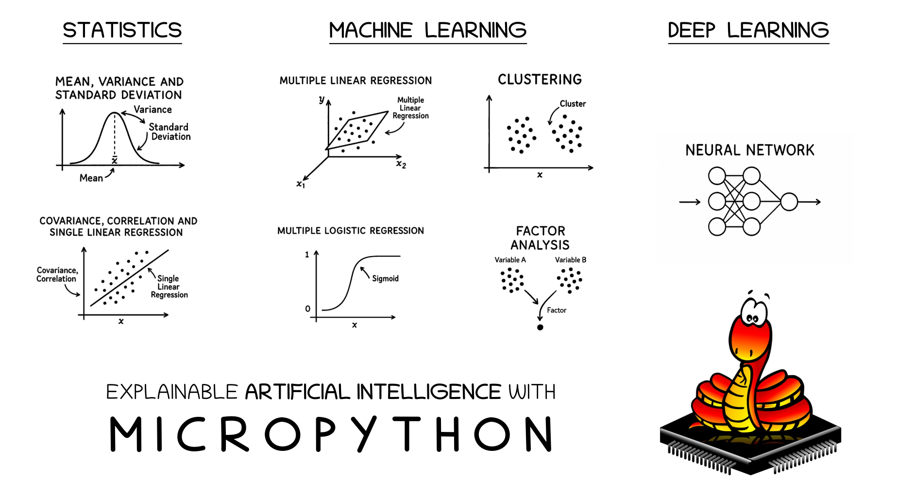

# XAI-MICROPYTHON
Explainable Artificial Intelligence (XAI) with MicroPython - a comprehensice codebook that covers relevant topics in AI **from statistical basics to machine learning and deep learning** and makes them **executable in MicroPython** (suitable for microcontrollers and devices like the PicoCalc) and live in your Browswer.

# Author
Prof. Dr. habil. Dennis Klinkhammer

# Requirements
MicroPython capable microcontrollers (or devices) or browser (e.g. Firefox).

# Live-Demo
XAI-MICROPYTHON can be used directly in the browser. The following link opens **Jupyter Lite** and the **Jupyter Notebook** with the name **xai-micropython.ipynb** can be called up by double-clicking. There is a concise explanation for each cell with MicroPython code, which can be extended as required in your own teaching settings. To execute the code, simply mark the corresponding cell and click on **Run Selected Cell**. Alternatively, all cells can be executed by clicking on **Run All Cells**. This is the link to the live-demo: [LIVE-DEMO](https://statistical-thinking.github.io/xai-micropython)

# Execution on a Microcontroller
XAI-MICROPYTHON is so lightweight that it can also be run on a microcontroller such as the **Raspberry Pi Pico 2**. To do this, simply transfer **main.py** to the microcontroller via ([THONNY](https://thonny.org/)), for example, and execute it. In addition, devices such as the [PICOCALC](https://www.clockworkpi.com/picocalc) can be used to **create your own learning devices** with XAI-MICROPYTHON. 

# Community Guidelines
XAI-MICROPYTHON is designed to be used in (academic) teaching without any technical requirements. A preselection of statistical functions as well as machine learning and deep learning methods are available for this purpose. However, their functionality and the addition of further algorithms and methods are a primary goal of XAI-MICROPYTHON. Interested users can therefore contact me at any time to make a corresponding contribution to the project :-)

# License
The current version 1.0.1 of XAI-MICROPYTHON is available under **MIT License**.
